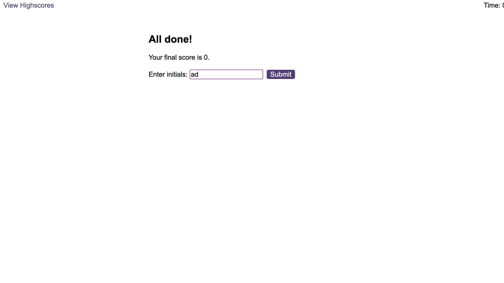

# QuizMasterJS-Timedcodingquiz
QuizMasterJS is an interactive and timed coding quiz built with HTML, CSS, and JavaScript

# Coding Quiz Challenge

Welcome to the Coding Quiz Challenge! Test your coding knowledge with this interactive quiz that includes questions on JavaScript, HTML, and CSS.

## Table of Contents
- [Overview](#overview)
- [Screenshots](#screenshots)
- [How to Play](#how-to-play)
- [Features](#features)
- [File Structure](#file-structure)
- [Credits](#credits)
- [License](#license)

## Overview

The Coding Quiz Challenge is a web-based quiz game designed to assess your understanding of fundamental web development concepts. The game features a timer, penalty for incorrect answers, and the ability to submit your score with initials to compete for a spot on the highscores list. 

## Screenshots

*Figure 1: Start Screen*

*Figure 2: Quiz Question*

*Figure 3: Feedback*

*Figure 4: End Screen*

*Figure 5: Highscores Page*

## How to Play

1. Click the "Start Quiz" button on the start screen to begin the quiz.
2. Answer each code-related question within the time limit.
3. Incorrect answers will result in a time penalty.
4. After completing the quiz, enter your initials to submit your score.
5. Visit the "View Highscores" link to see the highscores page.

## Features

- Interactive quiz with code-related questions.
- Timer to track the remaining time.
- Time penalty for incorrect answers.
- Submission of initials for highscores.
- Highscores page to view and clear highscores.

## File Structure

- `index.html`: Main HTML file for the quiz.
- `highscores.html`: HTML file displaying the highscores.
- `assets/`
  - `css/`: Stylesheet files.
  - `js/`: JavaScript files.
  - `sfx/`: Sound effects for correct and incorrect answers.
  - `screenshots/`: Screenshots for the README file.

## Credits

- **Author**: Arie David
- **Sound Effects**: Generic and Supplied by eDX

## License

This project is licensed under the [MIT License](LICENSE).